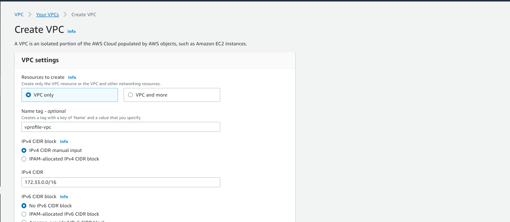
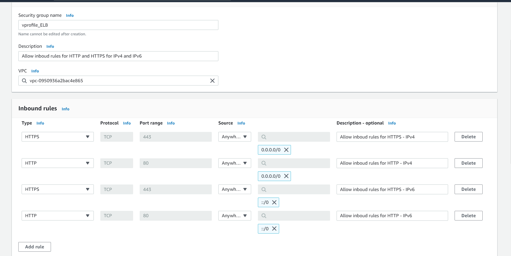

# Lift and shift: Rehost your workload on AWS

Workloads running on physical/virtual machines in a datacenter usually require multiple teams to manage services and the workloads with is complex especially when you would like to scale up or scale down.

Below is the rehosting architectural diagram

***1. Login into AWS Account***

***2. Create a VPC***

Search for VPC and click on ***create vpc***

- Select VPC only
- Enter a VPC name - ***vprofile-vpc***  or any preferred name.
- Assign cidr range, ***172.33.0.0/16*** in this case
- Click create VPC

***3. Create key Pairs***

To login securely into EC2 instance we need create private/public keys.

Type ***Key pair*** in the search bar, enter a ***name*** and click on ***create key pair***.

***4. Create Security groups (SG)***

We will create 3major security groups to allow required external and internal communication with the application.

*Load Balancer SG* - Allow inbound rules for HTTP and HTTPS for IPv4 and IPv6

- Enter the ***name*** and ***description***
- Select the ***VPC*** you just created
- Under **Inbound Rules**, click **Add rule**
- Allow HTTPS & HTTP for Anywhere cidr as seen in the diagram below.
- Add a Name tag and click ***Create Security group***

*Tomcat Instance SG* - 8080 of the application mapped to the LB

- Enter the ***name*** and ***description***
- Select the ***VPC*** you just created
- Under **Inbound Rules**, click **Add rule**
- Allow TCP port 8080 of the application to the Load balancer Security group.
- Add a Name tag and click ***Create Security group***

*Backend Services* -

- MySQL mapped to the application security group
- 1121 for memcached mapped to the application SG
- 5672 for RabbitMQ mapped to the application SG
- Allow all backend services communicate with each other.

***5. Lunch Instances with user data (BASH Script)***

5. Update IP to name mapping in route 53
6. Build Application from source code
7. Upload to S3 bucket
8. Download artifact to Tomcat EC2 Instance
9. Setup ELB with HTTPS (Cert from Amazon Certificate Manager)
10. Map ELB Endpoint to website name in host Zone.
11. Verify 
